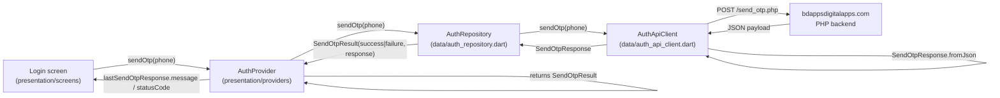

## Plan: OTP send response model

### TL;DR
Today `AuthApiClient.sendOtp` only inspects `body['message']` and discards the rest of the OTP payload (status code, detail, subscriber id, version). Add a `SendOtpResponse` model with `fromJson`, return it from the API client, expose a `SendOtpResult` from the repository, and let `AuthProvider.sendOtp` keep a typed instance so the UI/provider can read any field — not just `message`. Scope is `send_otp.php` only; `verify_otp.php` is unchanged because its response currently doesn't need the same treatment.

### Context (why nothing reached the provider before)
`auth_api_client.dart` throws `AuthApiException(message)` on `success == false`. The repository re-wraps as `AuthFailure`, which the provider catches — so `errorMessage` *should* populate. The new requirement is different: the provider must surface the whole typed response (especially `statusCode` like `E1853` and `statusDetail`) to the UI, not just `message`.

### Steps

1. **(depends on nothing)** Create `lib/features/auth/data/models/send_otp_response.dart`:
   - Immutable class with fields matching the wire payload: `success` (bool), `message` (String?), `referenceNo` (String?), `statusCode` (String?), `statusDetail` (String?), `version` (String?), `subscriberId` (String?).
   - `factory SendOtpResponse.fromJson(Map<String, dynamic> json)` mirroring the `PrayerTimings.fromJson` style (no `as` casts on nullable fields — assign with `as String?`).
   - Boolean parsing: `json['success'] == true` (tolerant of server returning `1`/`0` — covers a likely failure mode for an int/string bool).
   - Place file under `data/models/` to match the existing `prayer_times/data/models/` pattern.

2. **(depends on 1)** Update `lib/features/auth/data/auth_api_client.dart`:
   - Change `Future<String?> sendOtp(...)` -> `Future<SendOtpResponse> sendOtp(...)`.
   - Decode the body via `SendOtpResponse.fromJson(response.data!)` *first*, then branch on `response.success` (not `body['success'] != true`).
   - On `!success`, still throw `AuthApiException(response.message ?? 'Failed to send code.')` so the existing catch path in `AuthRepository` keeps working — provider gets `message` exactly as today.
   - `referenceNo` and the rest stay accessible via the typed return.

3. **(depends on 2)** Update `lib/features/auth/data/auth_repository.dart`:
   - Change `Future<void> sendOtp(...)` -> `Future<SendOtpResult> sendOtp(...)` (new file `auth_repository.dart` reuses; no new file needed).
   - Define `SendOtpResult` in this file: sealed-style class with `success: SendOtpSuccess(phoneNumber, response)` and `failure: SendOtpFailure(response)` cases that each carry the `SendOtpResponse` plus the phone number. Keeps the full server response in both branches so the provider can read `statusCode`/`statusDetail` even on success edges.
   - On `AuthApiException`, build a partial `SendOtpFailure` with an empty/synthetic response (message preserved) — matches today's behaviour where only `message` survives a thrown error.

4. **(depends on 3)** Update `lib/features/auth/presentation/providers/auth_provider.dart`:
   - Add `SendOtpResponse? lastSendOtpResponse` so callers can read `statusCode`/`statusDetail` directly.
   - `sendOtp` now stores `lastSendOtpResponse = result.response`, derives `errorMessage` from `result.response.message` (or the fallback) on failure, and still flips `loginStep` to `enterCode` only on the success branch.
   - `resendOtp` continues to call `sendOtp`; no other call sites change.

5. **(parallel with 1–4, optional but cheap)** Add a unit test under `test/features/auth/data/send_otp_response_test.dart` covering:
   - Parsing the user's exact sample payload (`success: false`, `statusCode: "E1853"`, `subscriberId: "tel:8801676667735"`).
   - A `success: true` payload with `referenceNo`.
   - An int `success` value (`1` -> true, `0` -> false) to lock in the tolerant parse.

### Relevant files
- `lib/features/auth/data/models/send_otp_response.dart` — **new**, the model from step 1.
- `lib/features/auth/data/auth_api_client.dart` — switch return type and parsing (step 2).
- `lib/features/auth/data/auth_repository.dart` — add `SendOtpResult` + `SendOtpFailure`/`SendOtpSuccess`; expose `SendOtpResponse` upward (step 3).
- `lib/features/auth/presentation/providers/auth_provider.dart` — store the response on the provider (step 4).
- `test/features/auth/data/send_otp_response_test.dart` — new test file (step 5).

### Diagrams



```mermaid
sequenceDiagram
  participant UI as LoginScreen
  participant P as AuthProvider
  participant R as AuthRepository
  participant C as AuthApiClient
  participant S as PHP backend

  UI->>P: sendOtp("8801676667735")
  P->>P: isSubmitting = true; notify
  P->>R: sendOtp(phone)
  R->>C: sendOtp(phone)
  C->>S: POST /send_otp.php (form-encoded user_mobile)
  S-->>C: 200 {success:false, message:"...", statusCode:"E1853", statusDetail:"...", subscriberId:"tel:..."}
  C->>C: SendOtpResponse.fromJson(body)
  C-->>R: SendOtpResponse(success=false, message=..., statusCode=E1853, ...)
  C->>R: throw AuthApiException(message) on !success
  R->>R: catch -> SendOtpFailure(response)
  R-->>P: SendOtpResult.failure(response)
  P->>P: errorMessage = response.message\nlastSendOtpResponse = response\nisSubmitting = false; notify
  P-->>UI: rebuild (shows error)
```

### Verification
1. `flutter analyze lib/features/auth` — should report no new lints (the new file uses the same patterns as `prayer_times/data/models/prayer_timings.dart`).
2. `flutter test test/features/auth` — model parsing test passes for the user's exact payload, the success payload, and the int-bool edge case.
3. Manual: re-run the failing flow against `https://www.bdappsdigitalapps.com/mosfeqanik/send_otp.php`. With `lastSendOtpResponse` now accessible, `AuthProvider` exposes `statusCode == "E1853"` and the matching `statusDetail`, while the UI still shows the same human-readable `message` string.
