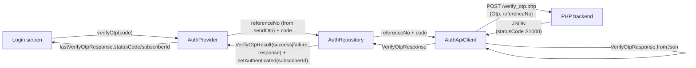

## Plan: Verify OTP response model

### TL;DR
Mirror the `send_otp.php` refactor for `verify_otp.php`. The verify payload changes from `{user_mobile, otp_code}` to `{Otp, referenceNo}`, the response no longer carries a `success` flag (success = `statusCode == "S1000"`), and the provider now keeps the typed `VerifyOtpResponse` so callers can branch on `statusCode`. The `referenceNo` rides along on the `SendOtpResult` so the provider doesn't have to remember it separately.

### Context (why the current code misbehaves today)
`auth_api_client.dart:36` sends `{'user_mobile', 'otp_code'}` — but the real `verify_otp.php` reads `Otp` + `referenceNo`. The check `body['success'] != true` is also wrong: the response has no `success` field at all (success is signal-by-`statusCode`), so the code throws on every reply, even a successful `S1000`.

### Steps

1. **(depends on nothing)** Create `lib/features/auth/data/models/verify_otp_response.dart`:
   - Fields matching the wire shape: `version`, `statusCode`, `statusDetail`, `subscriptionStatus`, `subscriberId`, plus the optional `referenceNo` echo (some 200-bodies may include it again, handle defensively).
   - `factory VerifyOtpResponse.fromJson(Map<String, dynamic> json)` using the same `as String?` nullable-cast style as `send_otp_response.dart`.
   - Convenience getter `bool get isSuccess => statusCode == 'S1000';` — single source of truth for "success", matching the user's wording ("statusCode: S1000").

2. **(depends on nothing, parallel with 1)** Create `test/features/auth/data/verify_otp_response_test.dart` covering the user's exact success payload and a failure payload where `statusCode != "S1000"`.

3. **(depends on 1)** Update `lib/features/auth/data/auth_api_client.dart`:
   - Change `Future<void> verifyOtp(...)` -> `Future<VerifyOtpResponse> verifyOtp(...)` with signature `(String referenceNo, String code)`. Drop the unused `phoneNumber` arg — the response's `subscriberId` is what binds the verify to the device.
   - Send `data: {'Otp': code, 'referenceNo': referenceNo}` (form-encoded via the existing `_formEncoded` option) — verbatim from the user message.
   - Remove the `body['success'] != true` check; always return `VerifyOtpResponse.fromJson(response.data!)`. Match the `sendOtp` pattern (let the repository decide what "success" means).

4. **(depends on 1 + 3)** Update `lib/features/auth/data/auth_repository.dart`:
   - Add a parallel sealed `VerifyOtpResult` with `VerifyOtpSuccess` / `VerifyOtpFailure` branches, each carrying `referenceNo` + `VerifyOtpResponse`.
   - `Future<VerifyOtpResult> verifyOtp(String referenceNo, String code)`:
     - On `response.isSuccess` -> return `VerifyOtpSuccess(...)` AND call `_storage.setAuthenticated(phoneNumber: ...)`. The phone number to persist is read from `response.subscriberId` (strip the `tel:` prefix, since the existing storage code expects the 11-digit BD form).
     - Otherwise -> return `VerifyOtpFailure(...)` (no persistence).
     - On `DioException` -> throw `AuthFailure(_messageForDioException(e))` (unchanged behavior).
   - Drop the `AuthApiException` catch — `verifyOtp` on the client no longer throws it.

5. **(depends on 1 + 3 + 4, parallel with 2)** Update `lib/features/auth/presentation/providers/auth_provider.dart`:
   - Add `VerifyOtpResponse? lastVerifyOtpResponse`.
   - `sendOtp` now stores the `referenceNo` from the API response on the provider (extract from `result.response.referenceNo` after a successful send). Move that field onto the `SendOtpSuccess` case rather than the wider `SendOtpResult` base — keeps `SendOtpFailure` honest about not having a reference number.
   - `verifyOtp(code)` now reads the persisted `referenceNo` from provider state, calls the updated repository, pattern-matches on the result:
     - `VerifyOtpSuccess` -> existing auth-state updates (set `phoneNumber`, `status = authenticated`) and store `lastVerifyOtpResponse`.
     - `VerifyOtpFailure` -> `errorMessage = statusDetail ?? 'Invalid code.'`, store `lastVerifyOtpResponse`.
   - `phoneNumber` setter changes: read `state.response.subscriberId` and strip a leading `tel:` prefix to match what `LocalStorageService.setAuthenticated` expects today (11-digit BD local number). If the user confirms storage accepts the full `tel:...` form instead, this is a one-line change.

6. **(parallel with all)** Once the verify shape is final, update `lib/main.dart` / `auth_api_client.dart` wiring (if any). Nothing should change in `main.dart` — only `verifyOtp`'s signature does, and only the provider calls it.

### Relevant files
- `lib/features/auth/data/models/verify_otp_response.dart` — **new**, model from step 1.
- `lib/features/auth/data/auth_api_client.dart` — change payload + return type (step 3).
- `lib/features/auth/data/auth_repository.dart` — sealed `VerifyOtpResult`, persistence on success (step 4).
- `lib/features/auth/data/models/send_otp_response.dart` — add `referenceNo` exposure (already present, no shape change needed).
- `lib/features/auth/presentation/providers/auth_provider.dart` — capture `referenceNo` on send, store typed verify response, switch error message source (step 5).
- `test/features/auth/data/verify_otp_response_test.dart` — new test file (step 2).

### Diagrams



```mermaid
sequenceDiagram
  participant U as LoginScreen
  participant P as AuthProvider
  participant R as AuthRepository
  participant C as AuthApiClient
  participant S as PHP backend

  Note over P: referenceNo captured during previous sendOtp
  U->>P: verifyOtp("270958")
  P->>P: isSubmitting = true; notify
  P->>R: verifyOtp(referenceNo="213561321321613", code="270958")
  R->>C: verifyOtp(referenceNo="213561321321613", code="270958")
  C->>S: POST /verify_otp.php (form {Otp:"270958", referenceNo:"213561321321613"})
  S-->>C: 200 {version:"1.0", statusCode:"S1000", statusDetail:"Success", subscriptionStatus:"REGISTERED", subscriberId:"tel:..."}
  C->>C: VerifyOtpResponse.fromJson(body)
  C-->>R: VerifyOtpResponse(statusCode="S1000", ...)
  R->>R: isSuccess -> setAuthenticated(subscriberId stripped)
  R-->>P: VerifyOtpSuccess(response)
  P->>P: phoneNumber = strip tel:; status=authenticated; lastVerifyOtpResponse=response; notify
  P-->>U: rebuild (router -> /home)
```

### Verification
1. `flutter analyze lib/features/auth` — clean (no new lints beyond existing baseline).
2. `flutter test test/features/auth` — both `SendOtpResponse` and `VerifyOtpResponse` test groups pass, including the user's exact S1000 payload and a failure payload (`statusCode: "E1999"`).
3. Manual: re-run against `https://www.bdappsdigitalapps.com/mosfeqanik/verify_otp.php` with a real `referenceNo` + valid code. Expect `AuthProvider.lastVerifyOtpResponse.statusCode == "S1000"` and `phoneNumber` persisted; invalid code persists nothing and surfaces `statusDetail` in `errorMessage`.
4. Open question to confirm with user (after implementation): does `LocalStorageService.setAuthenticated` already strip `tel:` itself, or should the provider strip it? Whichever path is chosen, only a one-line change is needed.
